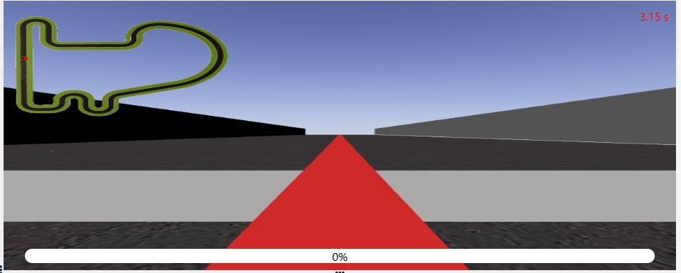
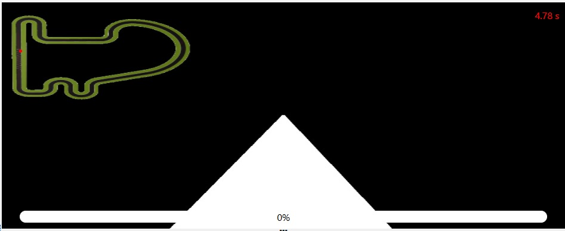
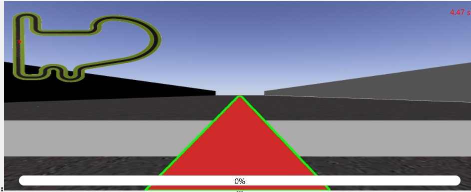
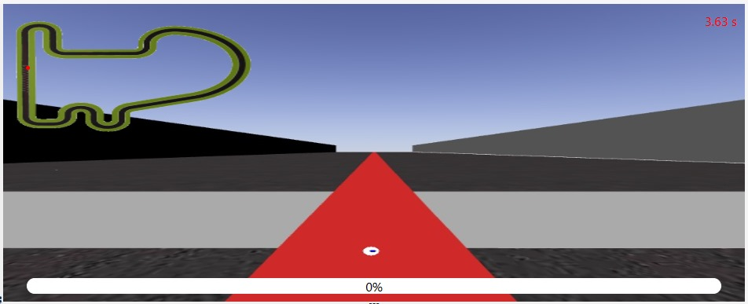

  <!-- Imagen dentro del post -->

# Reporte: Implementación del seguimiento en línea en diferentes circuitos

## 1. Introducción

Este documento detalla la implementación del sistema de seguimiento de línea mediante visión computacional y control PID en un robot autónomo. Se presentan las soluciones técnicas empleadas para mejorar la estabilidad y eficiencia del sistema en dos tipos de circuitos:

Circuito Simple: Implementación base con ajustes generales en el control PID y procesamiento de imágenes.

Circuito Ackerman: Modificaciones específicas para mejorar el rendimiento en un circuito con giros más cerrados y restricciones adicionales en la dirección del robot.

El objetivo principal fue optimizar la precisión de seguimiento de la línea roja en diferentes condiciones, minimizando oscilaciones y mejorando la estabilidad en curvas*

## **<h2 class="circuito-titulo">Circuito Simple</h2>**
## **<h2 class="circuito-titulo">Ackerman</h2>**

## Circuito Simple

## 2. Descripción del Proceso y Soluciones Técnicas Implementadas

### 2.1. Adquisición y Preprocesamiento de Imágenes


#### Adquisición de la Imagen

El sistema utiliza una cámara incorporada en el robot para capturar imágenes del entorno en tiempo real. Estas imágenes sirven como la entrada al sistema de visión por computadora y son procesadas a una alta frecuencia para permitir el seguimiento continuo de la línea.




#### Conversión al Espacio de Color HSV
Uno de los primeros pasos en el procesamiento de las imágenes es la conversión de la imagen del espacio de color BGR (azul, verde, rojo) a HSV (matiz, saturación, valor). El espacio HSV es particularmente útil en visión por computadora porque separa el componente de color (matiz) de los componentes de brillo (saturación y valor), lo que facilita la detección de colores específicos en condiciones de iluminación cambiantes.


```python
hsv = cv2.cvtColor(image, cv2.COLOR_BGR2HSV)
```

#### Definición de los Rangos de Color Rojo
Para detectar la línea roja, se definieron dos rangos en el espacio de color HSV. Esto se debe a que el color rojo tiene dos tonalidades: una cerca del valor 0 (rojo claro) y otra cerca del valor 180 (rojo oscuro) en el espectro HSV.

    • Rango inferior del rojo claro: lower_red1 = np.array([0, 120, 70])
    • Rango superior del rojo claro: upper_red1 = np.array([10, 255, 255])
    • Rango inferior del rojo oscuro: lower_red2 = np.array([170, 120, 70])
    • Rango superior del rojo oscuro: upper_red2 = np.array([180, 255, 255])

Estas máscaras se crean con la función cv2.inRange, que devuelve una imagen binaria donde los píxeles dentro del rango especificado son blancos (255) y los que están fuera del rango son negros (0).


```python
mask1 = cv2.inRange(hsv, lower_red1, upper_red1)
mask2 = cv2.inRange(hsv, lower_red2, upper_red2)
mask = cv2.bitwise_or(mask1, mask2)
```




#### Filtrado Morfológico

Una vez que se ha generado la máscara de la línea roja, se aplica un filtro morfológico para reducir el ruido. Los filtros morfológicos como la operación de apertura y cierre se utilizan para limpiar la máscara y eliminar pequeñas manchas que no forman parte de la línea.


```python
kernel = np.ones((5, 5), np.uint8)
mask = cv2.morphologyEx(mask, cv2.MORPH_OPEN, kernel)
mask = cv2.morphologyEx(mask, cv2.MORPH_CLOSE, kernel)
```

### 2.2 Detección de Contornos

Una vez que se ha limpiado la máscara de la línea roja, el siguiente paso es detectar los contornos de la línea utilizando la función cv2.findContours. Este paso es crucial porque nos permite identificar la forma de la línea y su ubicación en la imagen.


```python
contours, _ = cv2.findContours(mask, cv2.RETR_EXTERNAL, cv2.CHAIN_APPROX_SIMPLE)
```

Aquí se utiliza `cv2.RETR_EXTERNAL` para detectar solo los contornos externos, ya que la línea roja es el contorno principal que queremos rastrear.




### 2.3. Cálculo del Centro de la Línea

Una vez que se han detectado los contornos, el siguiente paso es encontrar el centro de la línea en la imagen. Esto se hace calculando el centroide del contorno de la línea utilizando los momentos de la imagen. Los momentos proporcionan la información necesaria para calcular el centro de masa del contorno.


```python
M = cv2.moments(largest_contour)
cX = int(M["m10"] / M["m00"])
cY = int(M["m01"] / M["m00"])
```

El cálculo del centro de la línea `(cX, cY)` es crucial para determinar la dirección en la que el robot debe moverse.



### 2.4. Control PID para Seguimiento de la Línea

#### Proceso de Control PID

El controlador PID ajusta la dirección y la velocidad del robot en función del error calculado entre el centro de la imagen y el centro de la línea. El error se calcula como la diferencia entre el centro de la imagen y la posición de la línea detectada en el eje X.

```python
error = cX - frame_center
```

- PID - **Proporcional (P)**: Este término calcula la cantidad de corrección basada directamente en el error.

    ```python
    p_control = Kp * error
    ```
- PID - **Derivativo (D)**: Este término calcula la tasa de cambio del error, lo que ayuda a reducir las oscilaciones y mejora la estabilidad.

    ```python
    d_control = Kd * (error - prev_error)
    ```
- PID - **Integral (I)**: Este término acumula el error a lo largo del tiempo. Inicialmente, se probó con la ganancia integral activada, pero se encontró que acumulaba errores y provocaba inestabilidad, por lo que se decidió desactivarla en la mayoría de las pruebas.
    ```python
    integral += error
    i_control = Ki * integral
    ```

El control PID se usa para calcular el valor de la dirección (steering):

```python
raw_steering = p_control + i_control + d_control
```

#### Suavizado de la Dirección

Una de las soluciones implementadas para evitar las oscilaciones excesivas fue el uso de un filtro exponencial para suavizar los cambios en la dirección del robot. Este filtro suaviza las transiciones de la dirección, haciendo que el robot no reaccione de forma demasiado brusca a los pequeños errores.


```python
steering = alpha * prev_steering + (1 - alpha) * raw_steering
prev_steering = steering
```

El valor de alpha se ajustó para obtener una respuesta más suave. Un valor de alpha = 0.3 proporcionó un buen equilibrio entre velocidad de respuesta y suavidad.

#### Ajuste Dinámico de Velocidad

Se implementó un ajuste dinámico de la velocidad en función de la curvatura de la línea. En curvas cerradas, la velocidad se reduce para evitar que el robot se desestabilice.

```python
if abs(error) < 30:
    velocity = 5.0  # Recta
elif abs(error) >= 30 and abs(error) < 50:
    velocity = 3.0  # Curva moderada
else:
    velocity = 2.0  # Curva cerrada
```


## 3. Resultados y Evaluación

### 3.1. Mejor Tiempo Obtenido

El mejor tiempo registrado para completar el circuito fue de 139.98 segundos. Este tiempo representa una mejora con respecto a las primeras versiones del código, donde el robot sufría de inestabilidad al tomar las curvas y no lograba un seguimiento fluido de la línea.

### 3.2. Visualization

A continuación se muestra un vídeo del funcionamiento del código en el circuito simple:


<iframe width="740" height="473" src="https://www.youtube.com/embed/GcyK_XPTnEQ" title="YouTube video player" frameborder="1" allow="accelerometer; autoplay; clipboard-write; encrypted-media; gyroscope; picture-in-picture; web-share" referrerpolicy="strict-origin-when-cross-origin" allowfullscreen></iframe>


### 3.3. Posibles Razones para el Tiempo Obtenido

El tiempo obtenido, aunque satisfactorio, puede verse influenciado por varios factores, que incluyen:

- Ajustes de Ganancias PID: Durante el proceso, se realizaron numerosos ajustes en las ganancias del controlador PID (Proporcional, Integral, Derivativo) para mejorar la estabilidad y la respuesta en las curvas. La reducción de las ganancias proporcionales y derivativas, y la eliminación de la componente integral, ayudaron a minimizar las oscilaciones en las curvas, pero aún podrían mejorar más en condiciones de curvas más cerradas.
- Curvas y Rectas: El robot fue más eficiente en las rectas debido a la alta velocidad de avance, que fue ajustada dinámicamente según la curvatura. Sin embargo, las curvas más cerradas seguían siendo un desafío, donde el robot tuvo que reducir su velocidad considerablemente. Las estrategias para suavizar la dirección, como el filtro exponencial, también contribuyeron a reducir las oscilaciones, pero se mantuvieron ciertas oscilaciones al tomar giros muy cerrados.
- Condiciones del Circuito: El circuito de pruebas también tiene un impacto importante en el tiempo final. Las características del trazado, como las curvas cerradas, el tiempo de recuperación cuando el robot pierde la línea, y la calidad de la visión computacional (ruido en la imagen o condiciones de luz) juegan un papel crucial en el rendimiento. Las condiciones ambientales y la precisión de la detección de la línea afectaron directamente la capacidad del robot para mantener el ritmo en el circuito.
- Algoritmos de Recuperación: Cuando el robot no podía seguir la línea de forma continua, el sistema de recuperación entraba en acción. Este modo de recuperación permitía que el robot buscara la línea nuevamente de manera eficiente, pero con cierta penalización en el tiempo. Sin embargo, este ajuste es necesario para garantizar que el robot no se quede atascado, lo que afecta los tiempos globales.

### 3.3. Consideraciones para Mejorar el Tiempo

Aunque el tiempo de 136.56 segundos es un buen resultado, aún existen áreas de mejora:
- Optimización del Control PID: Ajustar más finamente las ganancias del PID podría mejorar aún más la respuesta del robot en curvas cerradas, permitiéndole mantener una velocidad más alta sin perder estabilidad.
- Mejora en el Algoritmo de Recuperación: La optimización de las estrategias de recuperación permitirá reducir el tiempo perdido cuando el robot se desvía de la línea. Un sistema más rápido y eficiente de búsqueda de la línea podría disminuir el tiempo total.
- Condiciones de Visión: Mejorar las condiciones de iluminación y optimizar la cámara también puede ayudar a mejorar la detección de la línea, lo que reduce los tiempos perdidos por no identificar correctamente la línea.

## 4. Conclusiones
Este proyecto ha demostrado cómo el uso de técnicas avanzadas de visión por computadora, como la conversión de imágenes a HSV, la detección de contornos y el procesamiento morfológico, pueden ser efectivas para el seguimiento de una línea en robótica. El controlador PID ajustado dinámicamente permitió una respuesta estable y eficiente en curvas y rectas.
Aunque los resultados fueron satisfactorios, se identificaron áreas de mejora, como la reducción de las oscilaciones en curvas extremadamente cerradas y la optimización del algoritmo de recuperación. Se recomienda seguir afinando los parámetros PID y explorar el uso de técnicas adicionales, como el aprendizaje automático, para mejorar aún más la robustez y eficiencia del sistema.


## Ackerman

## Reporte de Modificaciones en el Seguimiento de Línea para el Circuito Ackerman

## 1. Introducción 

El presente documento detalla las modificaciones implementadas en el código original de seguimiento de línea para adaptarlo a las características del circuito Ackerman. Se han realizado ajustes en el control PID, el procesamiento de imágenes y la estrategia de ajuste de velocidad para mejorar la estabilidad y el rendimiento en este tipo de pista.

## 2. Cambios Implementados

### 2.1. Ajustes en el Control PID

El control PID se ha recalibrado para mejorar la estabilidad del robot en el circuito Ackerman. Los cambios principales son:
- Reducción de oscilaciones: Se modificaron los valores de las constantes PID, utilizando un KP_BASE más bajo (0.0065) para suavizar movimientos y un KD_BASE más alto (0.005) para mejorar la amortiguación de oscilaciones.
- Menor acumulación de error: Se disminuyó la ganancia integral (KI_BASE = 0.000002) para evitar acumulaciones excesivas de error, lo cual es particularmente problemático en curvas cerradas.
- Historial de errores: Se implementó un historial de errores con suavizado exponencial para reducir variaciones bruscas y mejorar la estabilidad.
- PID dinámico: Se ajustan las ganancias Kp, Ki y Kd dinámicamente en función del error relativo al centro de la imagen, permitiendo mayor flexibilidad en rectas y curvas.

**Código Relevante**:

```python
Kp = KP_BASE * (1.0 + 0.2 * abs(smoothed_error) / frame_center)
Ki = KI_BASE * (1.0 - 0.1 * abs(smoothed_error) / frame_center)
Kd = KD_BASE * (1.0 + 0.6 * abs(smoothed_error) / frame_center)
```
### 2.2. Modificaciones en la Estrategia de Velocidad

El ajuste de velocidad se ha mejorado para que el robot adapte su velocidad en función de la curvatura detectada:
- Velocidad más alta en rectas: Se estableció una velocidad de 18.0 en errores pequeños.
- Velocidad moderada en curvas suaves: Se redujo la velocidad a 12.0 en errores intermedios.
- Velocidad más baja en curvas cerradas: Se limitó la velocidad a 7.0 para evitar deslizamientos y pérdida de estabilidad en giros bruscos.

**Código Relevante**:
```python
if abs(smoothed_error) < 10:
    v = 18.0  # Velocidad alta en rectas
elif abs(smoothed_error) < 30:
    v = 12.0  # Velocidad moderada en curvas suaves
else:
    v = 7.0  # Velocidad reducida en curvas cerradas
```

### 2.3. Mejoras en la Suavización del Control

Para evitar cambios bruscos en la dirección del robot:
- Historial de errores: Se mantiene un buffer de 5 errores recientes y se calcula un error suavizado basado en el promedio.
- Filtro exponencial: Se usa un factor de suavizado (alpha = 0.6) para reducir oscilaciones y cambios bruscos en la dirección.
- Limitación de giros bruscos: Se restringió el ángulo de dirección a un valor máximo de ±0.35 para evitar giros extremos que desestabilicen el robot.

**Código Relevante**:

```python
smoothed_steering = alpha * raw_steering + (1 - alpha) * smoothed_error
smoothed_steering = max(-0.35, min(0.35, smoothed_steering))
```

### 2.4. Procesamiento de Imagen Mejorado

Los cambios en la detección de la línea roja incluyen:
- Mantenimiento de umbrales HSV: Se mantuvieron los rangos del color rojo pero se aplicaron filtros morfológicos más efectivos para eliminar ruido.
- Uso de filtros de mediana y morfológicos: Se aplicó cv2.medianBlur() y operaciones de apertura y cierre para mejorar la detección de la línea.
- Mejor manejo de contornos: Se sigue utilizando cv2.findContours(), priorizando siempre el contorno más grande como la línea principal.

**Código Relevante**:

```python
mask = cv2.medianBlur(mask, 5)
kernel = np.ones((5, 5), np.uint8)
mask = cv2.morphologyEx(mask, cv2.MORPH_OPEN, kernel)
mask = cv2.morphologyEx(mask, cv2.MORPH_CLOSE, kernel)
```

## 3. Evaluación del Rendimiento
Los cambios implementados permitieron mejorar significativamente el desempeño del robot en el circuito Ackerman. Entre los resultados más relevantes se encuentran:
- Mayor estabilidad en curvas cerradas.
- Menor número de oscilaciones en giros.
- Mejor aprovechamiento de la velocidad en rectas.
- Tiempo total mejorado respecto a la versión anterior en el circuito estándar (**604.71** segundos).

A continuación se muestra el vídeo del resultado del circuito Ackerman:

<iframe width="740" height="473" src="https://www.youtube.com/embed/HukxSjl8BiI" title="YouTube video player" frameborder="1" allow="accelerometer; autoplay; clipboard-write; encrypted-media; gyroscope; picture-in-picture; web-share" referrerpolicy="strict-origin-when-cross-origin" allowfullscreen></iframe>


## 4. Conclusiones y Siguientes Pasos

Los cambios implementados lograron una mejor adaptación al circuito Ackerman, pero aún existen oportunidades de mejora:
- Optimización de la velocidad en giros cerrados: Se podría implementar un sistema predictivo para anticipar la necesidad de reducir velocidad en curvas antes de alcanzarlas.
- Implementación de un modelo de frenado progresivo: Para mejorar la transición entre velocidades y evitar cambios bruscos.


